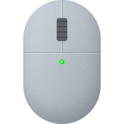
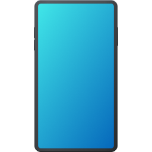

# Options

## Type

The type of operations the plugin will perform when its measure is updated.




This is the DEFAULT `Type`


**Description:** `Get/Update the Bluetooth status and Bluetooth devices`

**Plugin Measure:** `Returns 0`

**Available Bangs:**

* [#updatebluetoothstatus](bangs.md#updatebluetoothstatus "mention")
* [#disablebluetooth](bangs.md#disablebluetooth "mention")
* [#enablebluetooth](bangs.md#enablebluetooth "mention")
* [#togglebluetooth](bangs.md#togglebluetooth "mention")
* [#updatedevices](bangs.md#updatedevices "mention")



**Description:** `Get/Update the Bluetooth status.`

**Plugin Measure:** `Returns the Bluetooth Status`

**Available Bangs:**

* [#disablebluetooth](bangs.md#disablebluetooth "mention")
* [#enablebluetooth](bangs.md#enablebluetooth "mention")
* [#togglebluetooth](bangs.md#togglebluetooth "mention")
* [#updatebluetoothstatus](bangs.md#updatebluetoothstatus "mention")



**Description:** `Get/Update the Bluetooth devices`

**Plugin Measure:** `Returns 0`

**Available Bangs:**

* [#updatedevices](bangs.md#updatedevices "mention")




```ini
[BluetoothMeasure]
Measure=Plugin
Plugin=Bluetooth
Type=[0/1/2]
```


## UpdateAction

The list of bangs that needs to be executed when the measure is updated.


```ini
[BluetoothMeasure]
Measure=Plugin
Plugin=Bluetooth
UpdateAction=[!Log "Bang1" Debug][!Log "Bang2" Debug]
UpdateDivider=30
```


## OutputFile

The path of an output file you want to save the devices list to.

The file will have this structure:


```
device_name|device_address|device_id|connected[0,1]|paired[0,1]|can_pair[0,1]major_category|minor_category|has_battery_level[0,1]|battery|is_ble[0,1];
device_name|device_address|device_id|connected[0,1]|paired[0,1]|can_pair[0,1]major_category|minor_category|has_battery_level[0,1]|battery|is_ble[0,1];
...
```



```ini
[BluetoothMeasure]
Measure=Plugin
Plugin=Bluetooth
OutputFile=#CURRENTPATH#\Devices.txt
UpdateDivider=30
```


This example saves the list of devices in a file in `#CURRENTPATH#\Devices.txt`.

## ThumbnailsFolder

The path of the folder you want to save devices thumbnails to.

The thumbnails are managed by Windows, and are a visual representation of the [#major-category](section-variables.md#major-category "mention") or of the [#minor-category](section-variables.md#minor-category "mention") of the device if present.

```ini
[BluetoothDevicesMeasure]
Measure=Plugin
Plugin=Bluetooth
ThumbnailsFolder=#CURRENTPATH#\img
UpdateDivider=30
```

This example saves the images in the folder `#CURRENTPATH#\img`.

These are a couple of examples of thumbnails:

* mouse: 
* phone: 
* speaker: 
